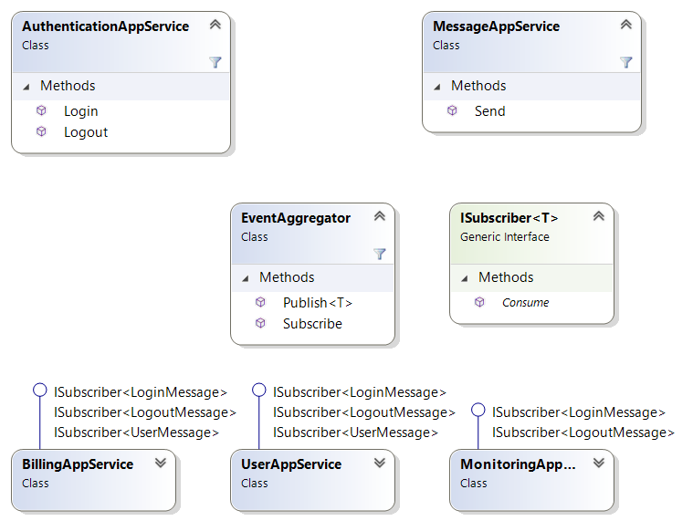

# IRC

In this kata you implement the Gang Of Four Event Aggregator Pattern [[1](#ref-1), [2](#ref-2)].

## Problem Description

An application shall provide a chat module similar to the original Internet Relay Chat (IRC) [[3](#ref-3)]. It will allow users to send messages to other users. A billing module records the time users have been logged in and the number of messages they have sent. A monitoring module shows how many users are logged in at the same time.

## Intended Application Structure

In order to implement the Event Aggregator Pattern, the program shall be composed of the following components:

- **AuthenticationAppService** allows users to login and logout
- **MessageAppService** allows a user to send a message from one to another user
- **EventAggregator** is the message hub as described by the Event Aggregator Pattern
- **ISubscriber** specifies the method a subscriber has to implement in order to receive events from the EventAggregator
- **BillingAppService** shows login and logout timestamp for each user
- **UserAppService** displays messages sent by another user to the current user
- **MonitoringAppService** shows system status information
- **IMessageView** is a helper class which collects all string messages intended for being displayed in a view to the user interface. This interface can be mocked in a unit test in order to ensure that the messages are rendered correctly. All App Services hold an instance of this interface for communicating with the user interface. This class is not necessary for the Event Aggregator Pattern, it is just used to simplify the application.

## Hint

- Keep the implementation as minimal as possible in order to keep the kata small. Just fulfill the requirements
- Use TDD. Tests first. Red, Green, Refactor.

## Requirements

- For a billing view record the user's login timestamp
- For a billing view record the user's logout timestamp
- Allow a user to see when another user has logged in
- Allow a user to see when another user has logged out
- For a billing view record the number of messages sent by the user
- For a monitoring view record the number of users logged in at the same time

## Finishing Touches

- Avoid duplicated code (use `tools\dupfinder.bat`).
- Fix all static code analysis warnings.
- Check the Cyclomatic Complexity of your source code files. For me, the most complex class hat a value of (tbd) and the most complex method has a value of (tbd). See Visual Studio -> Analyze -> Calculate Code Metrics.

## References

<a name="ref-1">[1]</a> David Starr and others: "Event Aggregator" in "Pluralsight: Design Patterns Library", https://www.pluralsight.com/courses/patterns-library, last visited on Apr. 23, 2020.

<a name="ref-2">[2]</a> Erich Gamma, Richard Helm, Ralph Johnson, John Vlissides: "Design Patterns: Elements of Reusable Object-Oriented Software", Addison Wesley, 1994, pp. 151ff, [ISBN 0-201-63361-2](https://en.wikipedia.org/wiki/Special:BookSources/0-201-63361-2).

<a name="ref-3">[3]</a> Wikipedia: "Internet Relay Chat", https://en.wikipedia.org/wiki/Internet_Relay_Chat, last visited on Apr. 23, 2020.